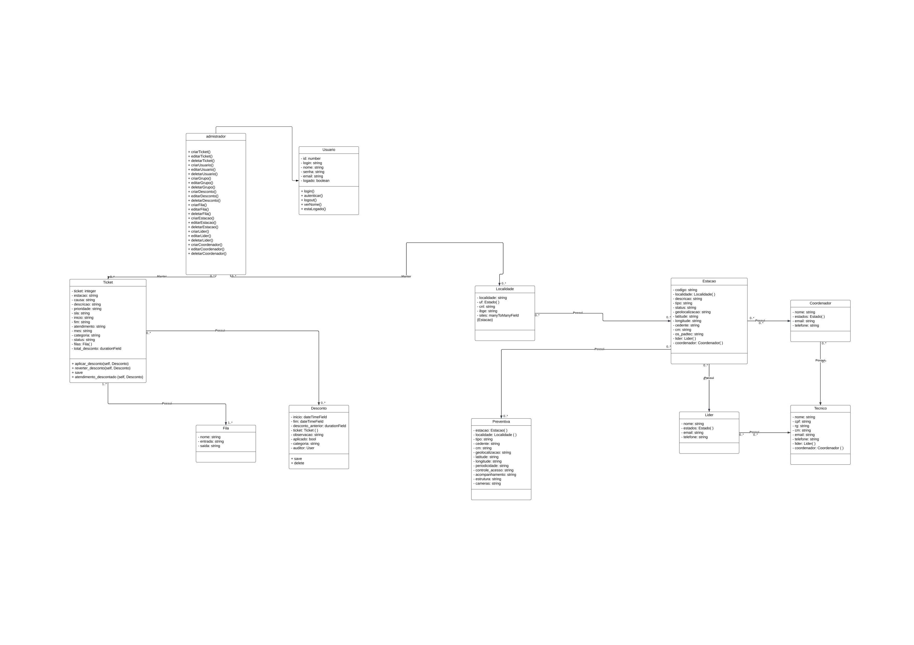

# Documento de Arquitetura de Software

## 1. Introdução

### 1.1. Finalidade
Este documento oferece uma visão geral arquitetural abrangente do sistema, usando diversas visões arquiteturais para representar diferentes aspectos do sistema. O objetivo deste documento é capturar e comunicar as decisões arquiteturais significativas que foram tomadas em relação ao sistema.

### 1.2. Escopo
Esse documento serve de guia para outros tópicos da construção arquitetural do software, abordando os principais pontos desenvolvidos na arquitetura do projeto, a partir desse breve resumo de cada tópico é possível se orientar com relação a outros documentos da arquitetura desenvolvidos no projeto, onde é possível ter uma visão detalhada de cada tema. 

## 2. Representação Arquitetural 

### Tecnologias

#### Frontend
 
 * **TypeScript**: TypeScript é uma linguagem de programação de código aberto desenvolvida pela Microsoft. É um superconjunto sintático estrito de JavaScript e adiciona tipagem estática opcional à linguagem.

 * **React**: O React é um conjunto de bibliotecas open source voltados para a criação de UIs interativas de forma mais fácil. Toda a lógica do React é escrita em JavaScript, facilitando a passagem de dados ao longo da aplicação. Essa tecnologia foi escolhida por conta da quantidade de conteúdo disponível na internet, facilitando o treinamento e aprendizado da equipe. Outro fator importante é a comunidade, que está sempre ativa para ajudar em possíveis dúvidas.

 * **Next.js**: O Next.js é uma estrutura da web de desenvolvimento front-end React de código aberto criada por Vercel que permite funcionalidades como renderização do lado do servidor e geração de sites estáticos para aplicativos da web baseados em React. É uma estrutura pronta para produção que permite que os desenvolvedores criem rapidamente sites estáticos e dinâmicos e é amplamente usada por muitas grandes empresas.

#### Backend

  * **Python**: Python é uma linguagem de programação de alto nível, interpretada de script, imperativa, orientada a objetos, funcional, de tipagem dinâmica e forte. 

  * **Django**: Django é um framework para desenvolvimento rápido para web, escrito em Python, que utiliza o padrão model-template-view. Também foi utilizado o banco de dados gerado pelo o Django que utilza o SQL.

## 3. Metas e Restrições da Arquitetura

### 3.1. - Restrições

-   O  _software_  deve ser desenvolvido nas tecnologias definidas;
-   O  _software_  deve rodar nos navegadores: Web Firefox, Google Chrome, Edge e Opera;
-   O ambiente de desenvolvimento do  _software_  deve funcionar tanto em Windows e Linux;
-   Para utilizar o  _software_  é necessário ter internet;

### 3.2. - Metas

As metas planejadas para a aplicação são:

-   **Portabilidade** – Deve ser possível utilizar a plataforma em qualquer navegador web.
-   **Usabilidade** - O  _software_  deve possuir alta aprendibilidade e inteligibilidade, para que atenda aos requisitos elicitados;
-   **Manutenibilidade** - O código e as documentações realizadas pelo grupo devem estar num nível de qualidade, seguindo os padrões de projeto e bibliografia, onde a sua manutenção seja fácil de ser realizada.

## 4. Visão Lógica

A visão lógica descreve como o sistema é estruturado, em termos de unidade e implementação. Mostra como está a organização conceitual do sistema em termos de camadas, pacotes, classes e interfaces. O relacionamento entre os elementos mostra as dependências, as realizações de interface, os relacionamento parte-todo e assim por diante.

### 4.1. Diagrama de Classes

## 5. Visão de Deploy
Descreve como a aplicação é disponibilizada para uso, seja em um ambiente de desenvolvimento, para testes ou em produção. O deploy será feito na rede da própria Telebras.

## 6. Visão de Implementação
### 6.1 Visão Geral
   Descreve como os artefatos de desenvolvimento estão organizados no sistema de arquivos. Os elementos são arquivos e diretórios (quaisquer itens de configuração). Isto inclui os artefatos de desenvolvimento e os artefatos de implantação. Esta visão é opcional quando do uso das Visões 4+1.

### 6.2 Diagrama de Classes
   O Diagrama de Classes é uma representação da estrutura e relações das classes que servem de modelo para os objetos. Consiste em um conjunto de objetos com as mesmas características. Dessa forma, consegue-se identificar os objetos e agrupá-los, de forma a encontrar suas respectivas classes.

## 7. Tamanho e Desempenho

### 7.1 Visão Geral

Discrição do desempenho e das características do software que impactam na arquitetura de software.

### 7.2 Requisitos Mínimos

- É necessário possuir conexão com a internet;
- Navegador com suporte a HTML 5, CSS e JavaScript;
- Para desenvolvimento de possuir: Windows ou Linux;

| Data       | Versão | Descrição                                                            | Autor(es)                                            |
| ---------- | ------ | -------------------------------------------------------------------- | ---------------------------------------------------- |
| 24/04/2024 | 1.0    | Criação e Modelagem do Documento de Arquitetura | [Danilo Domingo](https://github.com/danilow200)      |
