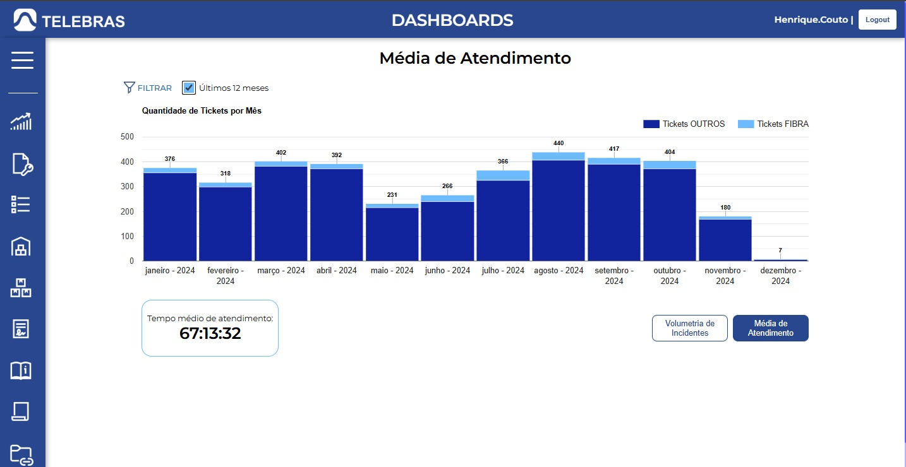

# Áreas do Portal

O Portal, atualmente, é organizado nas seguintes seções

- ***Dashboards***
- ***Manutenção***
- ***Operacional***
- ***Patrimônio***
- ***Inventário***
- ***Contratos***
- ***Base contratual***
- ***NTPs***
- ***Plataformas***

### Dashboards

Atualmente, a seção **Dashboards** apresenta um gráfico com a volumetria dos incidentes, o qual pode ser filtrado pelos meses (sendo possível selecionar automaticamente os últimos 12 meses).

Além disso, também apresenta o tempo médio de atendimento do mês/período selecionado, como pode ser visto na imagem abaixo:

