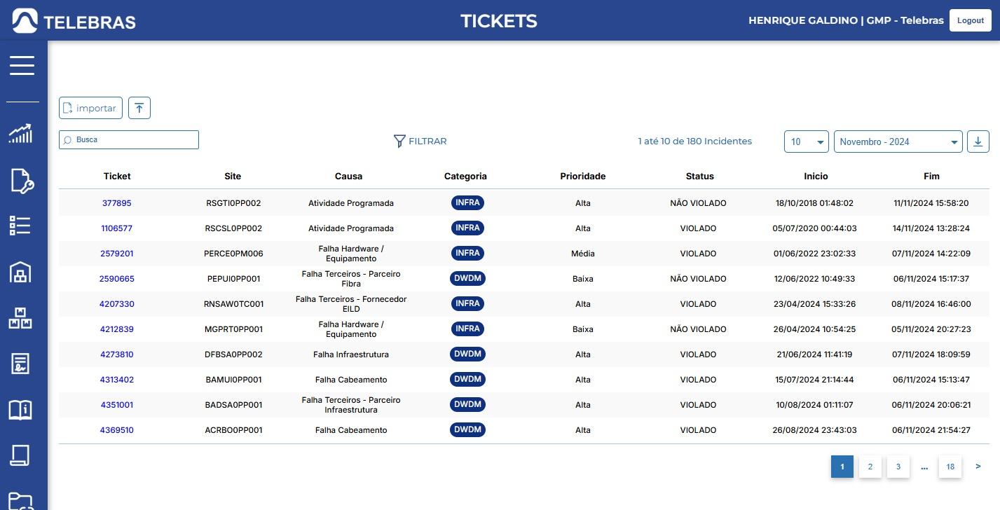
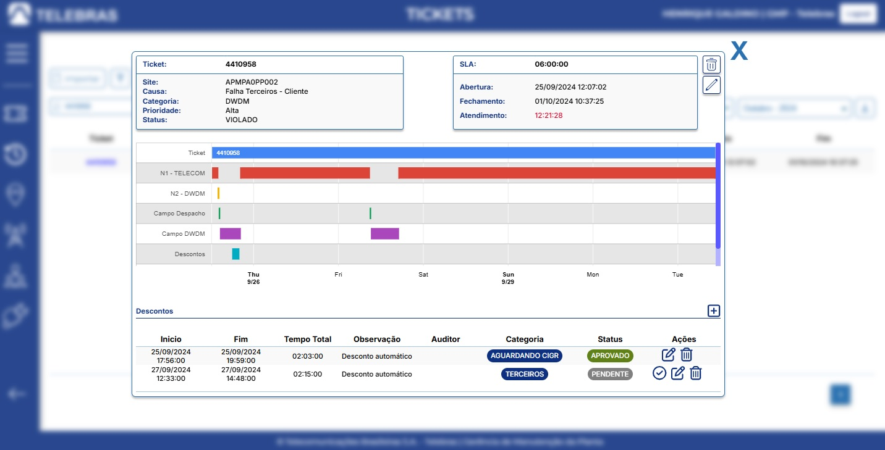
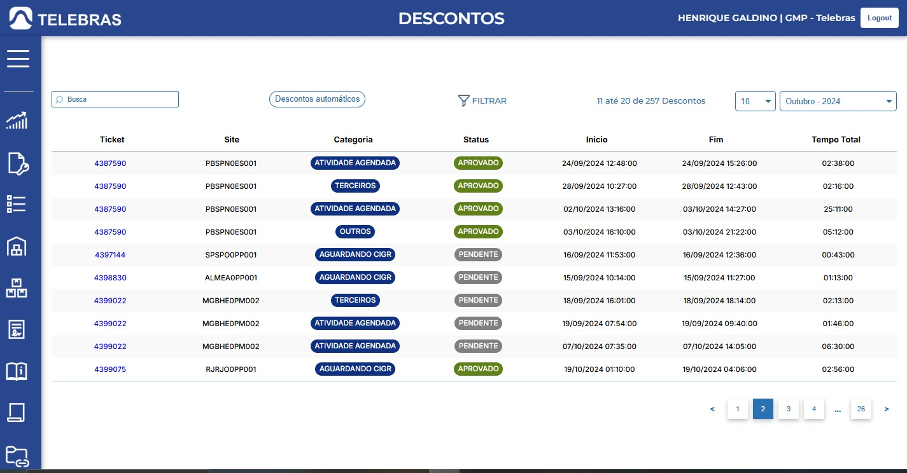
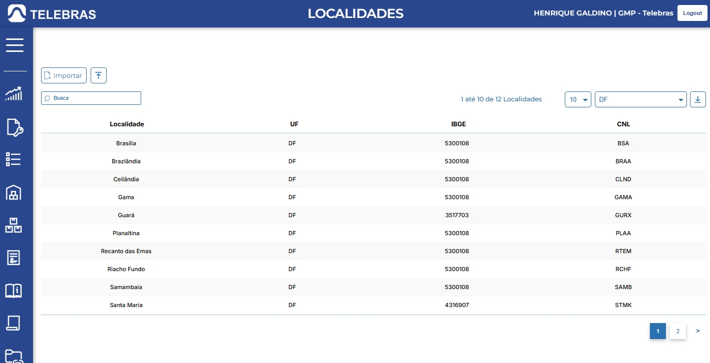
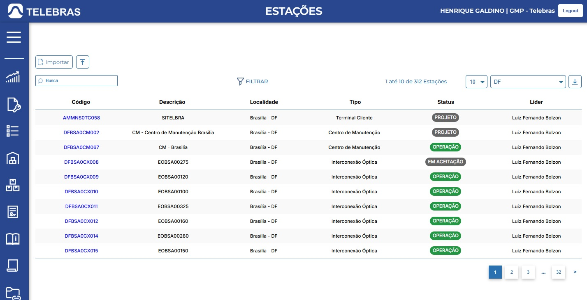
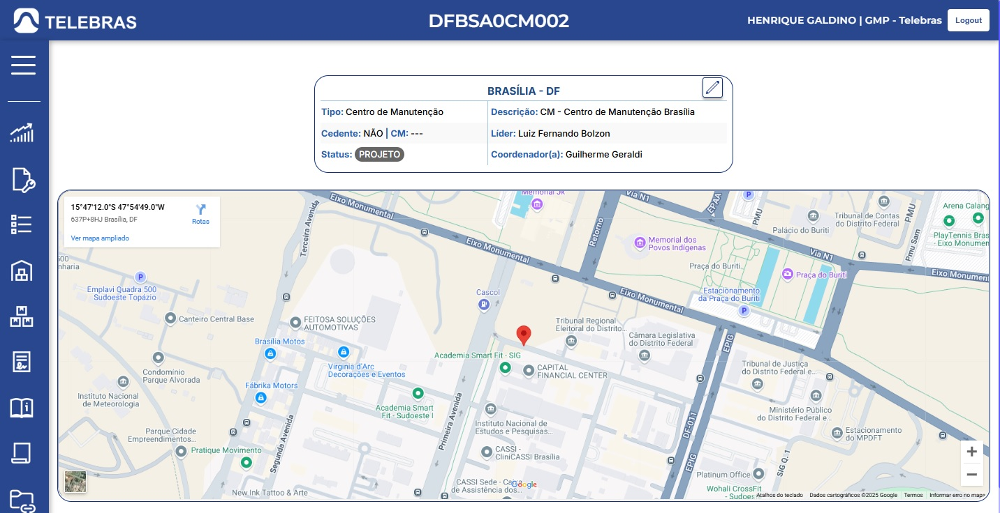

# **Áreas do Portal**

O Portal, atualmente, é organizado nas seguintes seções

- ***Dashboards***
- ***Manutenção***
- ***Operacional***
- ***Patrimônio***
- ***Inventário***
- ***Contratos***
- ***Base contratual***
- ***NTPs***
- ***Plataformas***

### **Dashboards**

Atualmente, a área **Dashboards** apresenta um gráfico com a volumetria dos incidentes, o qual pode ser filtrado pelos meses (sendo possível selecionar automaticamente os últimos 12 meses).

Além disso, também apresenta o tempo médio de atendimento do mês/período selecionado, como pode ser visto na imagem abaixo:

### **Manutenção**

A área ***Manutenção*** contém as informações relacionadas a rotina de incidentes, incluindo as seguintes seções:

- ***Tickets***
- ***Descontos***
- ***Localidades***
- ***Estações***
- ***Líderes***
- ***Técnicos***

#### **Tickets**

Atualmente, a seção *tickets* apresenta, em formato de tabela, a relação de tickets de incidentes abertos por mês/ano. É possível realizar o download dessa tabela no formato *.csv* e será ajustado para que este download seja feito no formato .xlsx, o formato de arquivos *excel*.

Além disto, é possível adicionar novos incidentes, adicionando um arquivo *.csv* importado do sistema *CPqD - Plant Management*.

Ao selecionar um *ticket*, uma janela pop-up contendo as informações do mesmo será exibida na tela. Nesta janela, os usuários que possuírem permissão poderão editar as informações do ticket, bem como expurgar, neutralizar ou aplicar descontos a este, como pode ser visto na imagem a seguir:

#### **Descontos**

Atualmente, a seção *descontos* apresenta, em formato de tabela, a relação de tickets que possuem descontos,
os quais estarão classificados como **PENDENTE**  ou **APROVADO**. Ao selecionar um *ticket*, a janela *pop-up* 
presente na seção ***Tickets*** será aberta. É possível filtrar os tickets por tipo e/ou status do desconto, além de aplicar os descontos
automáticos dentro do intervalo de tempo especificado pelo usuário.

A imagem abaixo mostra a seção ***Descontos***:

#### **Localidades**

Atualmente, a seção *localidades* apresenta, em formato de tabela, a relação de localidades 
cadastradas no sistema, sendo estas separadas por estado. É possível realizar o download dessa tabela no formato .csv e 
será ajustado para que este download seja feito no formato .xlsx, o formato de arquivos excel.
Abaixo, podemos ver uma imagem da seção ***Localidades***:

#### **Estações**

Atualmente, a seção *estações* apresenta, em formato de tabela, a relação de estações 
cadastradas no sistema, sendo estas separadas por estado. É possível realizar o download dessa tabela no formato .xlsx, 
o formato de arquivos excel.

Abaixo, podemos ver uma imagem da seção ***Estações***:

Ao selecionar uma *estaçãp*, o usuário será redirecionado para outra página, que contém os detalhes da estação. 
Nesta página, os usuários que possuírem permissão poderão ver a localização da estação no mapa e editar as informações da mesma,
como pode ser visto na imagem a seguir:

